## Por qué el PIB aparece en todas partes

{fig-align="center" width="100%"}

## PIB per cápita y tamaño económico

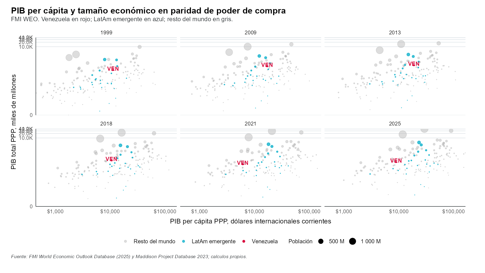{fig-align="center" width="100%"}

## PIB per cápita y tamaño económico, 1999

{fig-align="center" width="100%"}

## PIB per cápita y tamaño económico, 2008

{fig-align="center" width="100%"}

## PIB per cápita y tamaño económico, 2013

{fig-align="center" width="100%"}

## PIB per cápita y tamaño económico, 2018

{fig-align="center" width="100%"}

## PIB per cápita y tamaño económico, 2025

{fig-align="center" width="100%"}

## PIB nominal per cápita y tamaño económico, 1999

{fig-align="center" width="100%"}

## PIB nominal per cápita y tamaño económico, 2008

{fig-align="center" width="100%"}

## PIB nominal per cápita y tamaño económico, 2013

{fig-align="center" width="100%"}

## PIB nominal per cápita y tamaño económico, 2018

{fig-align="center" width="100%"}

## PIB nominal per cápita y tamaño económico, 2025

{fig-align="center" width="100%"}

## PIB per cápita PPP relativo a Venezuela

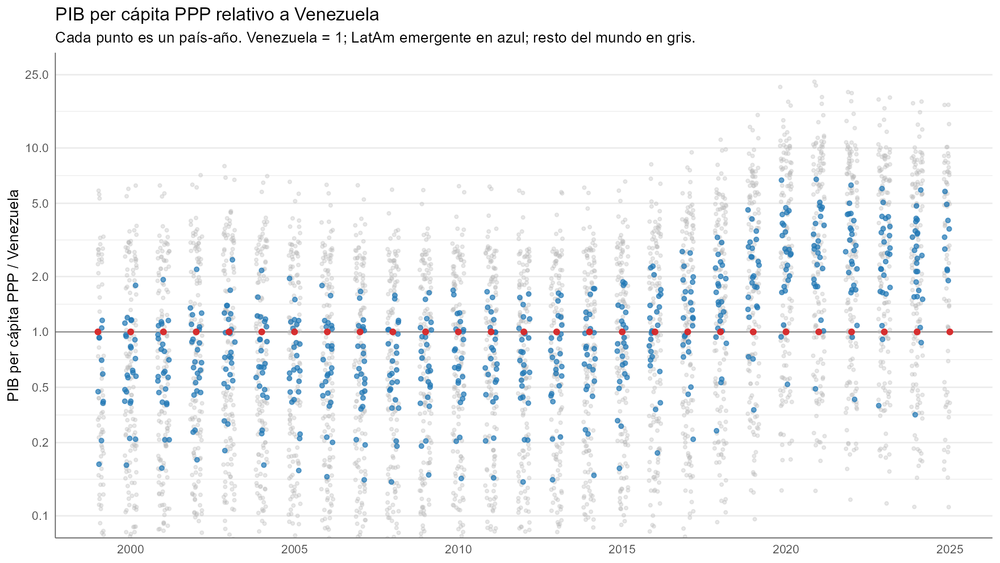{fig-align="center" width="100%"}

## PIB nominal per cápita relativo a Venezuela

{fig-align="center" width="100%"}

## PIB per cápita PPP relativo a Venezuela, años seleccionados

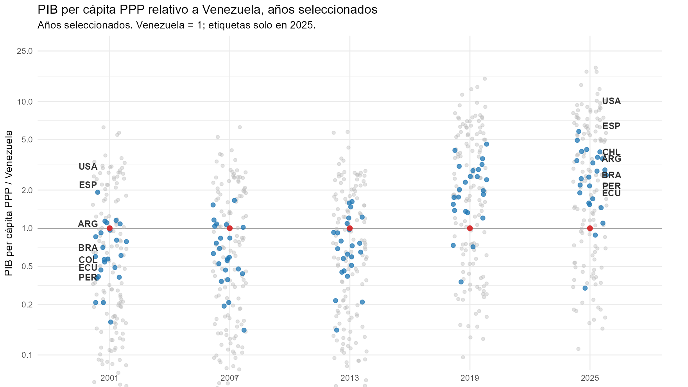{fig-align="center" width="100%"}

## PIB nominal per cápita relativo a Venezuela, años seleccionados

{fig-align="center" width="100%"}

## Crecimiento histórico

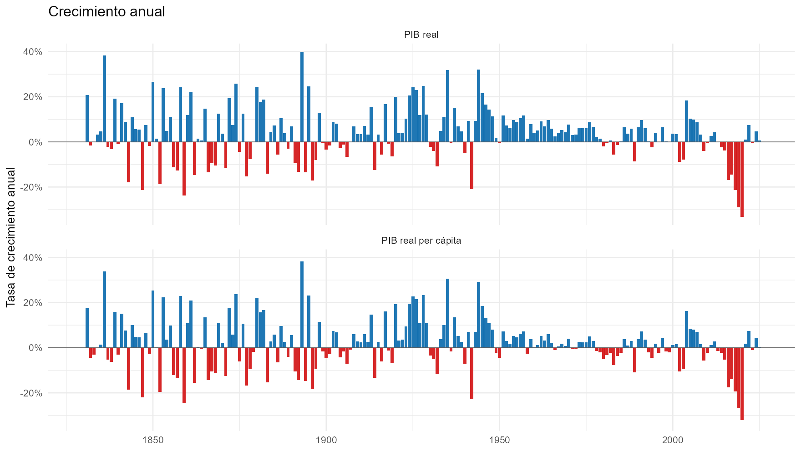{fig-align="center" width="100%"}

## Crecimiento del PIB real

{fig-align="center" width="100%"}

## Crecimiento del PIB real per cápita

{fig-align="center" width="100%"}

## Distribución del crecimiento anual

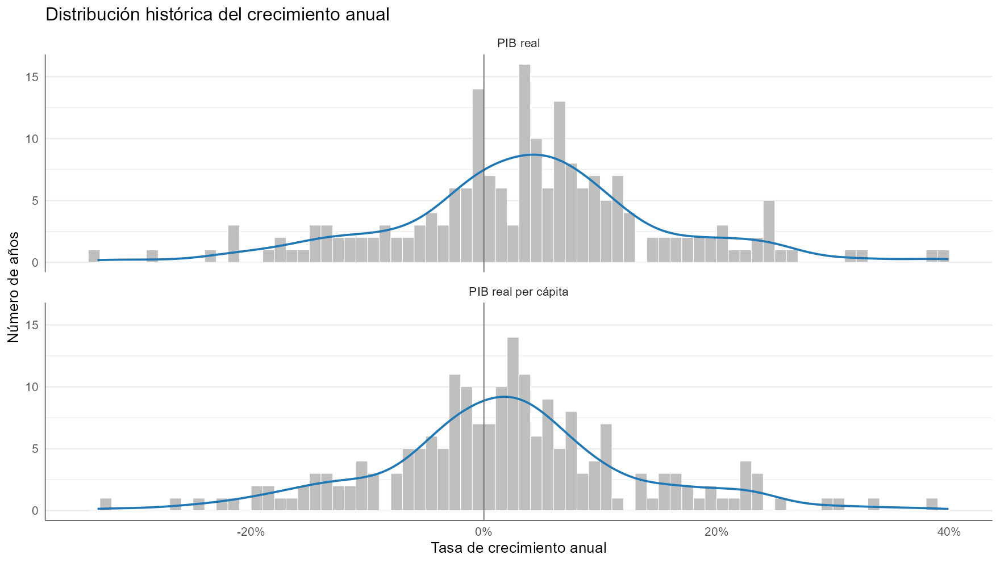{fig-align="center" width="100%"}

## Índices históricos

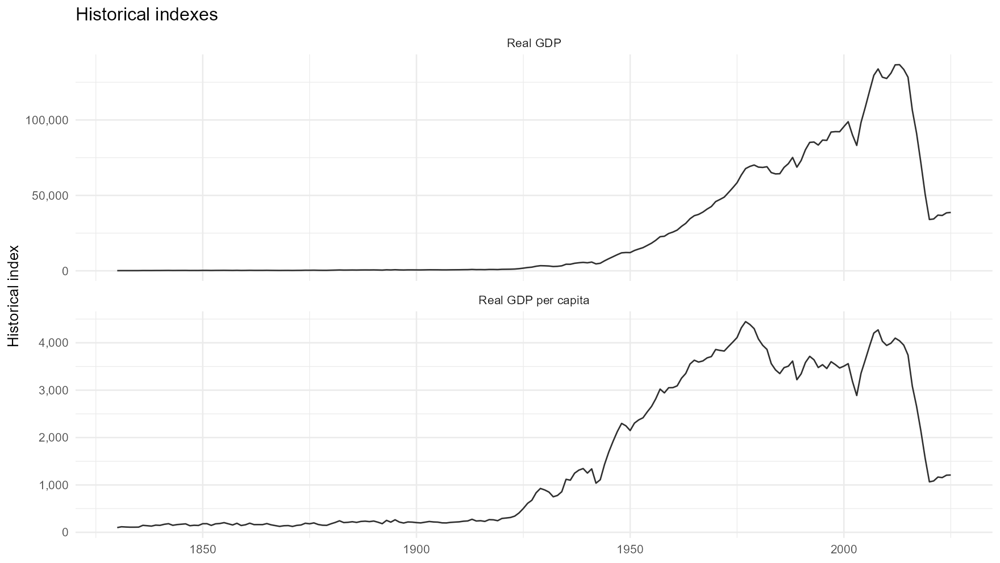{fig-align="center" width="100%"}

## Índice del PIB real

{fig-align="center" width="100%"}

## Índice del PIB real per cápita

{fig-align="center" width="100%"}

## Anclaje al último año

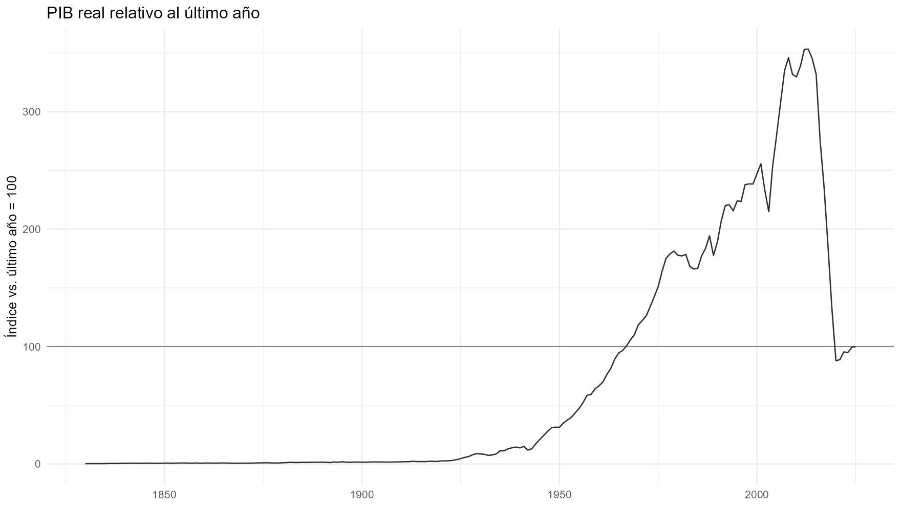{fig-align="center" width="100%"}

## Anclaje per cápita al último año

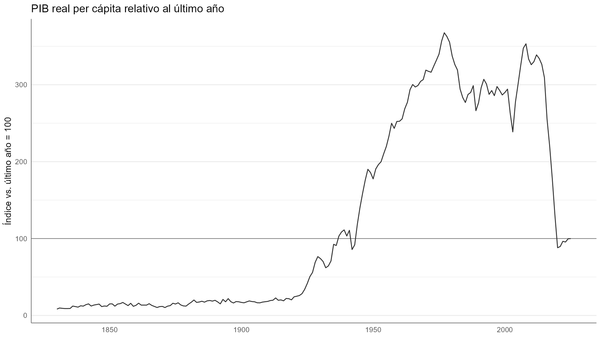{fig-align="center" width="100%"}

## Episodios históricos

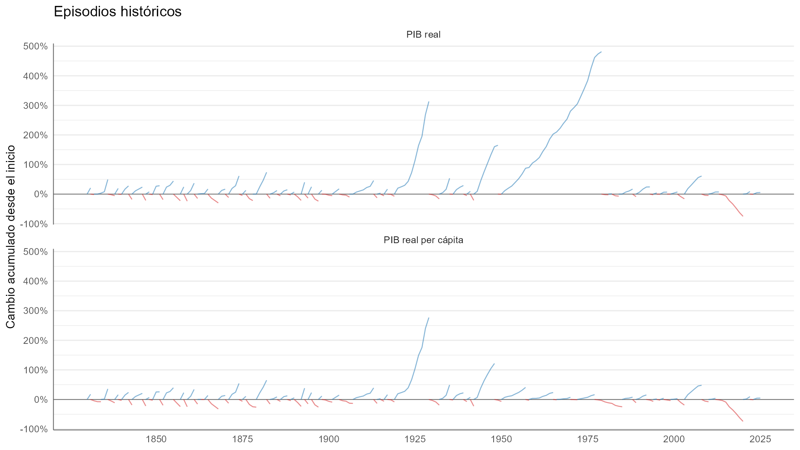{fig-align="center" width="100%"}

## Episodios positivos

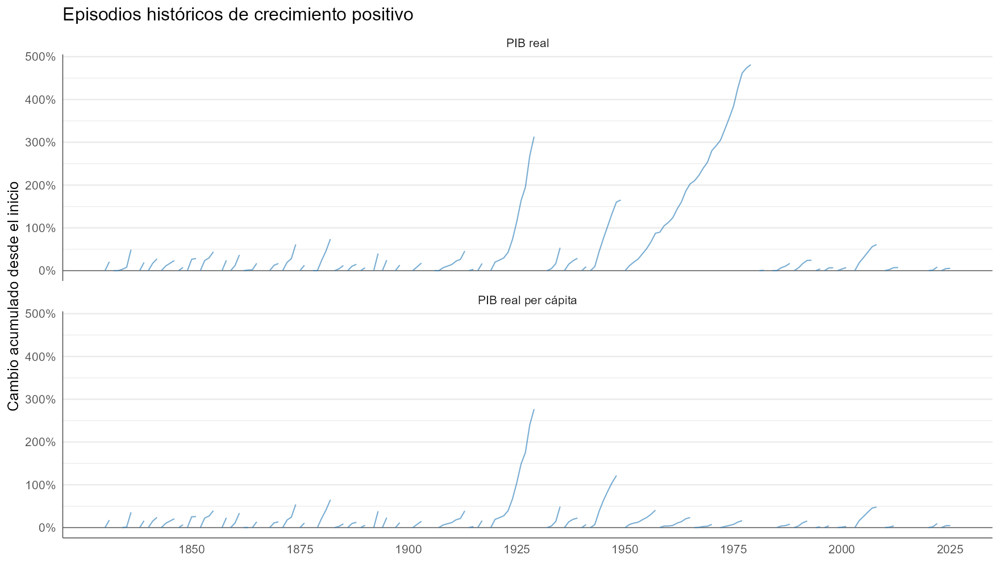{fig-align="center" width="100%"}

## Episodios negativos

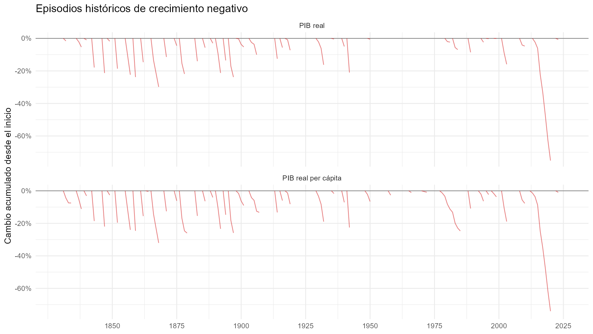{fig-align="center" width="100%"}

## Episodios del PIB real

{fig-align="center" width="100%"}

## Episodios positivos del PIB real

{fig-align="center" width="100%"}

## Episodios negativos del PIB real

{fig-align="center" width="100%"}

## Episodios del PIB real per cápita

{fig-align="center" width="100%"}

## Episodios positivos del PIB real per cápita

{fig-align="center" width="100%"}

## Episodios negativos del PIB real per cápita

{fig-align="center" width="100%"}

## Episodios negativos internacionales

{fig-align="center" width="100%"}

## Episodios negativos internacionales WDI

{fig-align="center" width="100%"}

## Episodios negativos internacionales FMI WEO

{fig-align="center" width="100%"}

## Peores episodios de contracción

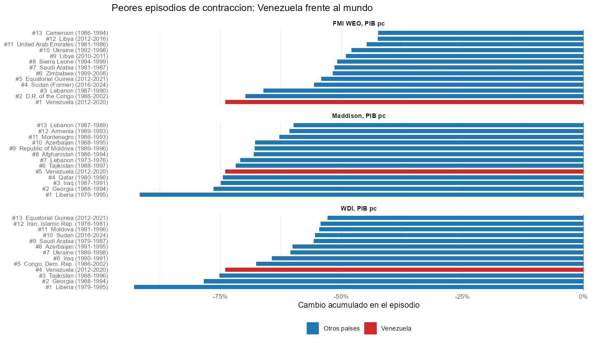{fig-align="center" width="100%"}

## Episodios de contracción más prolongados

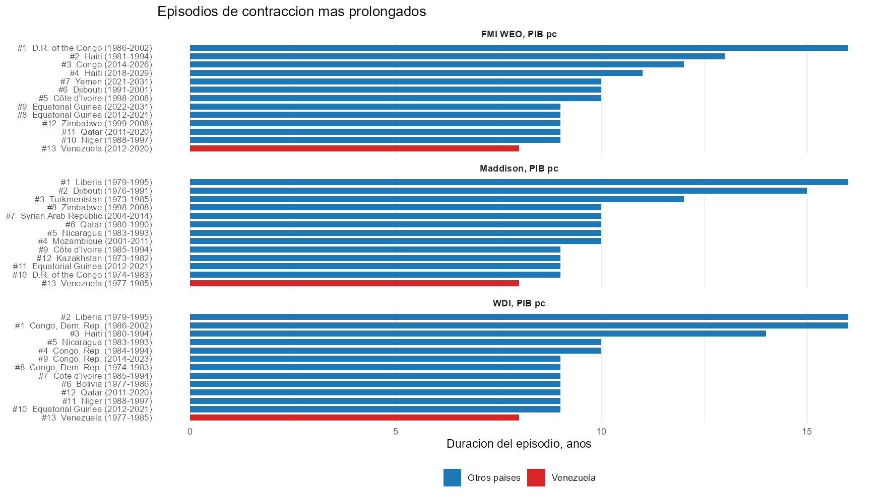{fig-align="center" width="100%"}

## Expansiones sostenidas de mayor crecimiento compuesto

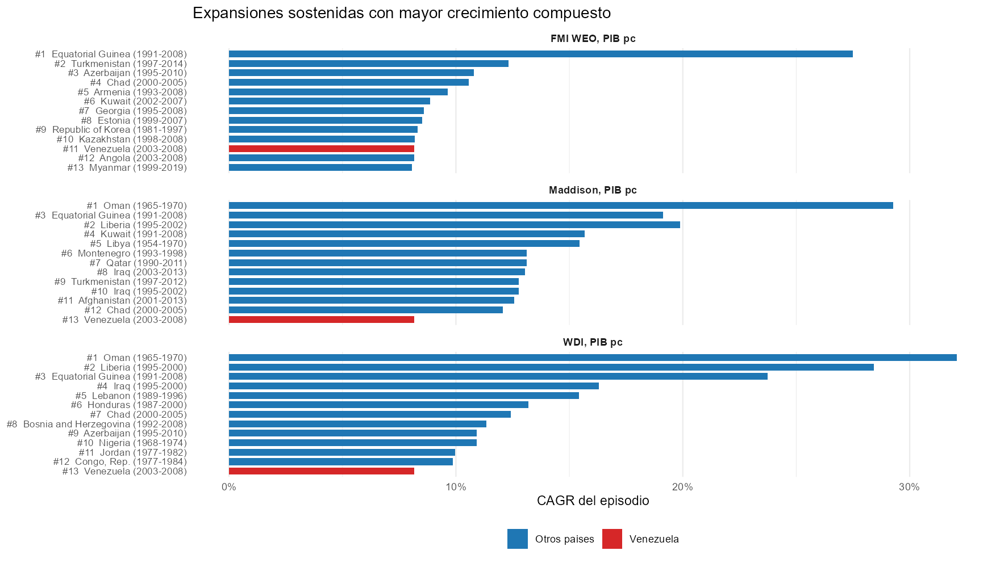{fig-align="center" width="100%"}

## Profundidad y años hasta recuperar

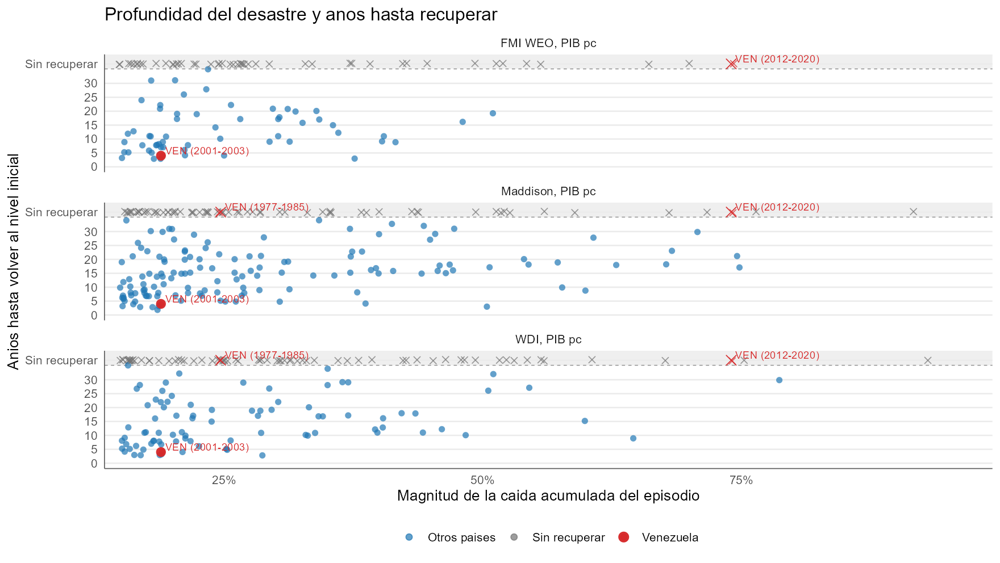{fig-align="center" width="100%"}

## Nivel posterior al desastre, 5 años

{fig-align="center" width="100%"}

## Nivel posterior al desastre, 10 años

{fig-align="center" width="100%"}

## Nivel posterior al desastre, 15 años

{fig-align="center" width="100%"}

## Nivel posterior al desastre, 20 años

{fig-align="center" width="100%"}

## Nivel posterior al desastre, 25 años

{fig-align="center" width="100%"}

## Nivel posterior al desastre, 30 años

{fig-align="center" width="100%"}

## Crecimiento compuesto posterior al desastre, 5 años

{fig-align="center" width="100%"}

## Crecimiento compuesto posterior al desastre, 10 años

{fig-align="center" width="100%"}

## Crecimiento compuesto posterior al desastre, 15 años

{fig-align="center" width="100%"}

## Crecimiento compuesto posterior al desastre, 20 años

{fig-align="center" width="100%"}

## Crecimiento compuesto posterior al desastre, 25 años

{fig-align="center" width="100%"}

## Crecimiento compuesto posterior al desastre, 30 años

{fig-align="center" width="100%"}

## Trayectoria de recuperación

{fig-align="center" width="100%"}

## Trayectoria de recuperación al 15%

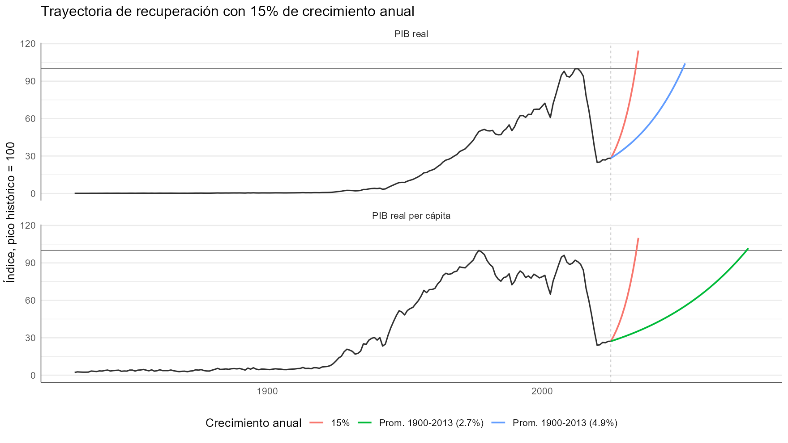{fig-align="center" width="100%"}

## Escenarios de recuperación

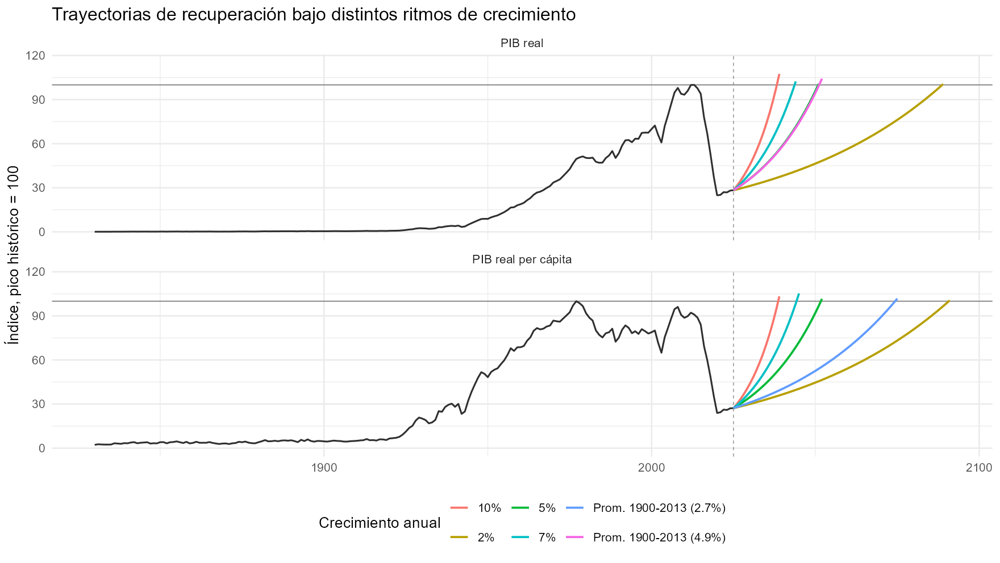{fig-align="center" width="100%"}

## Años para recuperar niveles históricos del PIB real

{fig-align="center" width="100%"}

## Años para recuperar niveles históricos per cápita

{fig-align="center" width="100%"}

## Ventanas móviles de crecimiento compuesto

{fig-align="center" width="100%"}

## Crecimiento sostenido en ventanas móviles

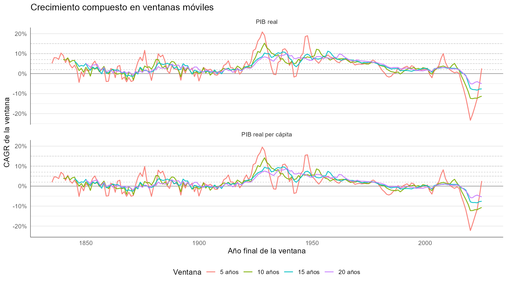{fig-align="center" width="100%"}

## Distribución de crecimiento sostenido

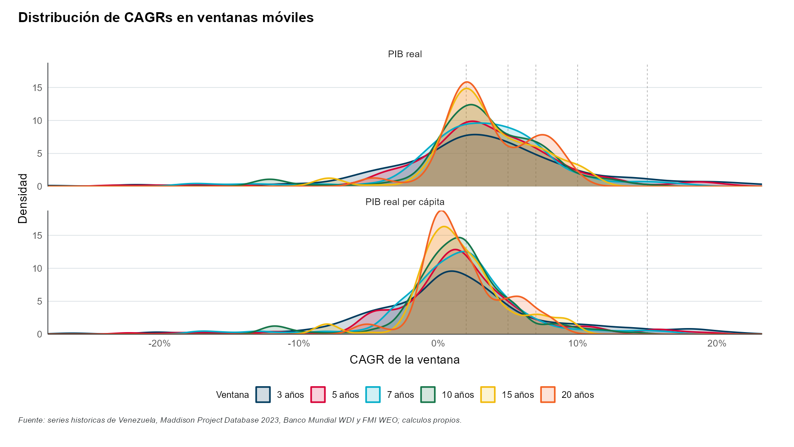{fig-align="center" width="100%"}

## Frecuencia de crecimiento sostenido del PIB real

{fig-align="center" width="100%"}

## Frecuencia de crecimiento sostenido per cápita

{fig-align="center" width="100%"}
